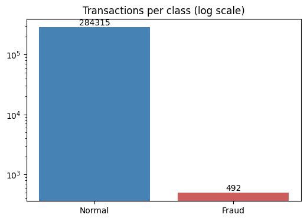
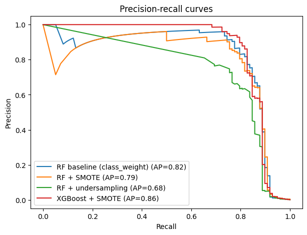
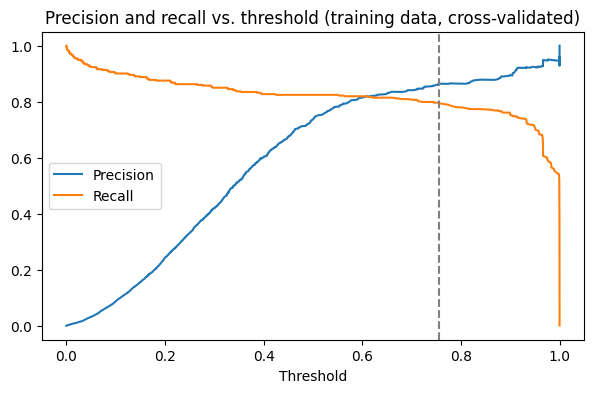

# Credit Card Fraud Detection

In this dataset, only about 0.17% of transactions are fraud. That means a model that says "not fraud" every time is 99.8% accurate and catches nothing. I built this project to see how to deal with that problem properly.

The whole analysis is in one notebook: [credit_card_fraud_detection.ipynb](./credit_card_fraud_detection.ipynb)

## The data

I used the [Credit Card Fraud Detection dataset](https://www.kaggle.com/datasets/mlg-ulb/creditcardfraud) from Kaggle. It has 284,807 transactions from European cardholders, and only 492 of them are fraud. The columns `V1` to `V28` are anonymized, and `Time` and `Amount` are the original values.



The file is about 150 MB, so I didn't upload it. To run the notebook, download `creditcard.csv` from Kaggle and put it in the project folder.

## What I did

1. Looked at the data and how imbalanced it is
2. Split it once (stratified) so every model is tested on the same data
3. Trained a baseline Random Forest with `class_weight="balanced"`
4. Tried two ways of fixing the imbalance on the training data only: **SMOTE** (creates synthetic fraud examples) and **random undersampling** (throws away most normal ones)
5. Trained XGBoost on the SMOTE data
6. Picked a better decision threshold using cross-validation on the training data, then checked it once on the test set

## Results

All numbers are for the fraud class on the test set (98 fraud cases out of 56,962 transactions).

| Model | Recall | Precision | F1 | PR-AUC |
|---|---|---|---|---|
| Random Forest baseline | 0.85 | 0.71 | 0.77 | 0.82 |
| Random Forest + SMOTE | 0.88 | 0.60 | 0.71 | 0.79 |
| Random Forest + undersampling | 0.92 | 0.04 | 0.08 | 0.68 |
| XGBoost + SMOTE | 0.89 | 0.53 | 0.66 | **0.86** |
| **Random Forest + SMOTE, tuned threshold (0.76)** | 0.81 | 0.80 | **0.80** | 0.79 |



What stood out:

- **Tuning the threshold helped the most.** With the default 0.5 cutoff, Random Forest + SMOTE gave too many false alarms. At 0.76 it caught 79 of the 98 frauds with about 20 false alarms.
- **Undersampling was a bad idea here.** It caught the most fraud (0.92 recall), but about 96% of its alerts were false alarms.
- **The plain baseline was already strong.** SMOTE didn't beat it on F1 unless I also tuned the threshold.
- **XGBoost had the best PR-AUC (0.86)**, but I only tested it at the default threshold, so its F1 looks lower than it might be.



One thing to keep in mind: the test set has only 98 fraud cases, so one extra catch changes recall by about 0.01. The gaps between the top models are small and could easily change with a different split.

## What I learned

- Accuracy is useless on data like this. Recall, precision, F1 and PR-AUC tell you what is going on.
- Always train a simple baseline first. Mine turned out to be hard to beat.
- The threshold is a business choice: how bad is a missed fraud compared with a false alarm?
- Choose the threshold on training data, not on the test set, or the score looks better than it really is.

## Run it yourself

```bash
git clone https://github.com/amna2105/Credit-Card-Fraud-Detection-Project.git
cd Credit-Card-Fraud-Detection-Project
pip install -r requirements.txt
```

Add `creditcard.csv` to the folder, then open the notebook in Jupyter and run all cells.

Built with Python, pandas, NumPy, scikit-learn, imbalanced-learn, XGBoost, matplotlib and seaborn.

## What I'd do next

- Tune the threshold for XGBoost too
- Cross-validate every model instead of relying on one split
- Try ADASYN or SMOTE + Tomek links
- Put the best model behind a small prediction API

## Credit

The starting point was a GeeksforGeeks tutorial. I added the undersampling comparison, XGBoost, the stratified split, and the threshold tuning.
